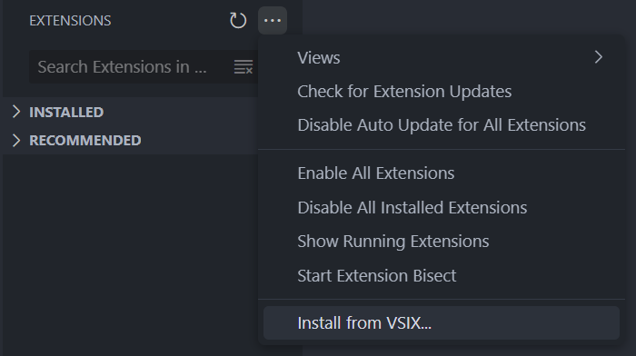

# ADE8 Language Support for Visual Studio Code

## Description

This extension provides syntax highlighting for the a8a assembly language. Designed by professors at the University of Modena and Reggio Emilia (Unimore).

## Features

- **Syntax Highlighting**: Supports color customization for comments, keywords, strings, numbers, and labels.

## Installation

Just upload the `a8a-1.0.0.vsix` file to VS Code extensions:

 

> **_NOTE:_**   If VS Code doesn't automatically recognize the language by the file extension select it manually from the bottom bar.

run `vsce package` to package the extension after an edit.
